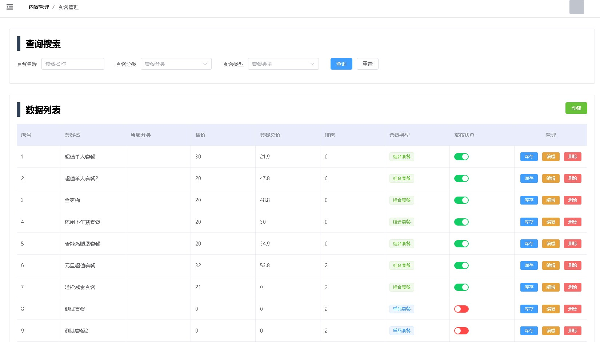
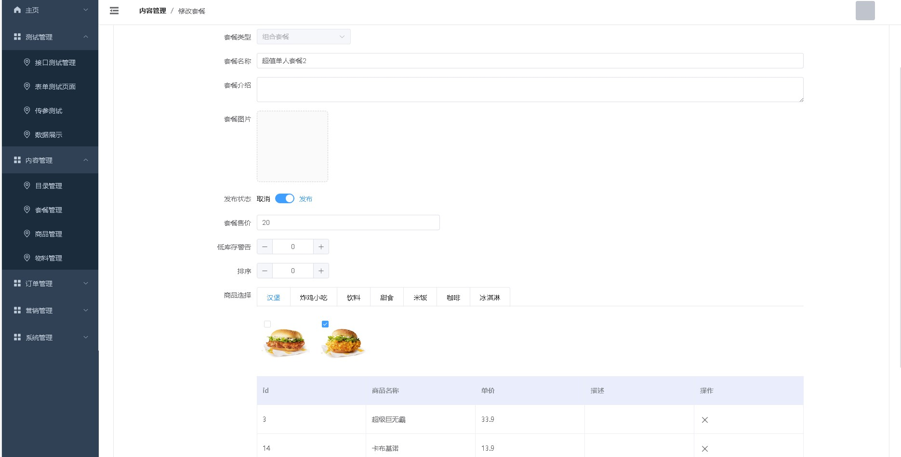
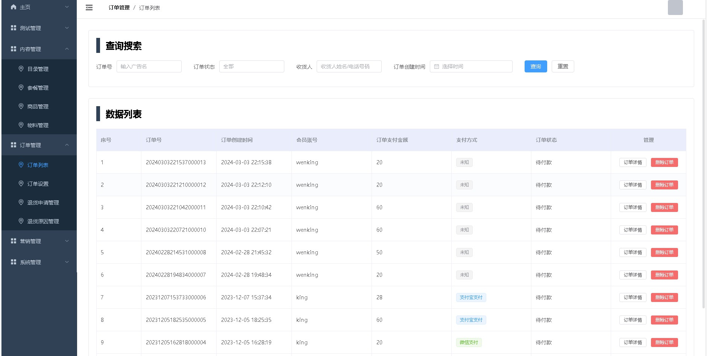
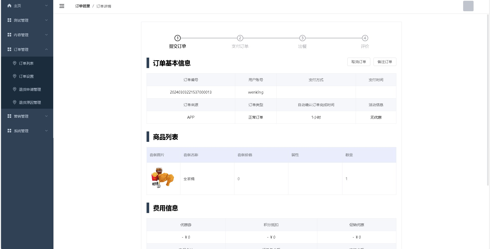
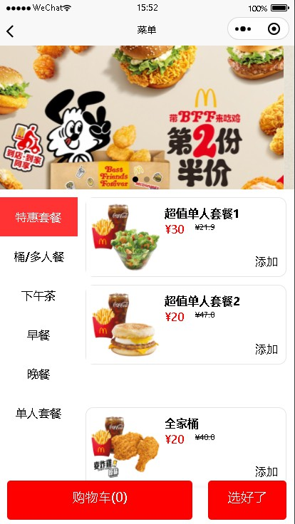
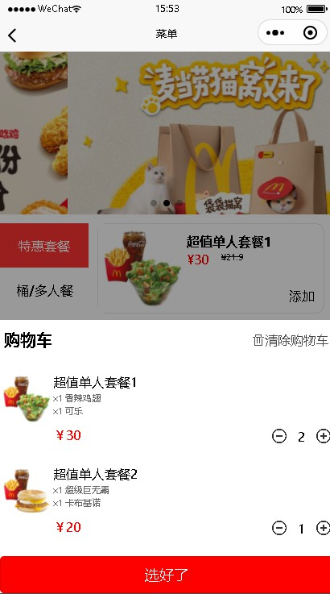
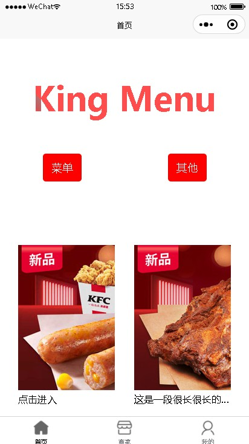

# king-food-template

## 项目文档

文档地址：暂无

## 项目介绍

`king-food-template`项目是一套基于快餐(kfc)点单系统后台管理系统。

### 项目演示

#### 后端项目

`king-food` 地址：https://github.com/378752389/king-food/

#### 后台管理系统

前端项目`king-food-admin`地址：https://github.com/378752389/king-admin-template

#### 前端小程序

前端项目`king-food-web`地址：https://github.com/378752389/king-admin-template

#### PC管理端技术

| 技术           | 说明                  | 官网                                   |
|--------------| --------------------- | -------------------------------------- |
| Vue          | 前端框架              | https://vuejs.org/                     |
| Vue-router   | 路由框架              | https://router.vuejs.org/              |
| Pinia        | 全局状态管理框架      | https://pinia.vuejs.org                |
| Element-Plus | 前端UI框架            | https://element.eleme.io               |
| Axios        | 前端HTTP框架          | https://github.com/axios/axios         |
| Js-cookie    | cookie管理工具        | https://github.com/js-cookie/js-cookie |
| nprogress    | 进度条控件            | https://github.com/rstacruz/nprogress  |

## 环境搭建

### 开发工具

| 工具          | 说明                | 官网                                            |
| ------------- | ------------------- | ----------------------------------------------- |
| VsCode        | 开发IDE             | https://code.visualstudio.com/         |
| Snipaste      | 屏幕截图工具        | https://www.snipaste.com/                       |
| Typora        | Markdown编辑器      | https://typora.io/                              |

### 搭建步骤

> Windows/Mac环境部署

- 按照项目依赖：yarn install
- 运行项目：yarn dev

